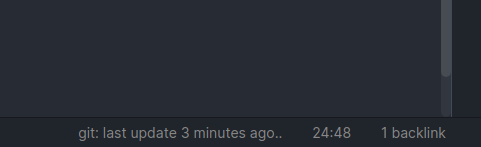

# Status Bar Pomo Timer for Obsidian

Simple plugin that displays a [pomodoro timer](https://en.wikipedia.org/wiki/Pomodoro_Technique) in the [Obsidian](https://obsidian.md/) status bar. 

## Use
Click the clock icon in the left ribbon pannel to start. Click again to toggle pause.

All of these actions are available from the command pallete. You can also set a hotkey to quit the timer.

## Settings

You can change the duration of the pomodoro timer, breaks, and interval between long breaks, and toggle the end of timer sound.

### Logging

If you enable logging, the plugin will write to the file you specify as your log file at the end of each pomodoro. If no such file exists, it will be created at the end of your first pomo. By default, the log message is "🍅 dddd, MMMM DD YYYY, h:mm A" (e.g. "🍅 Friday, July 16 2021, 6:18 PM"), but you can specfiy your own message using [moment disply format](https://momentjs.com/docs/#/displaying/format/).

Enable "Log active note" to include a link to the active note at the time the pomodoro timer started at the end of the log message.

## Compatability
Only tested on Linux, but should work fine on Windows and Mac as well.

